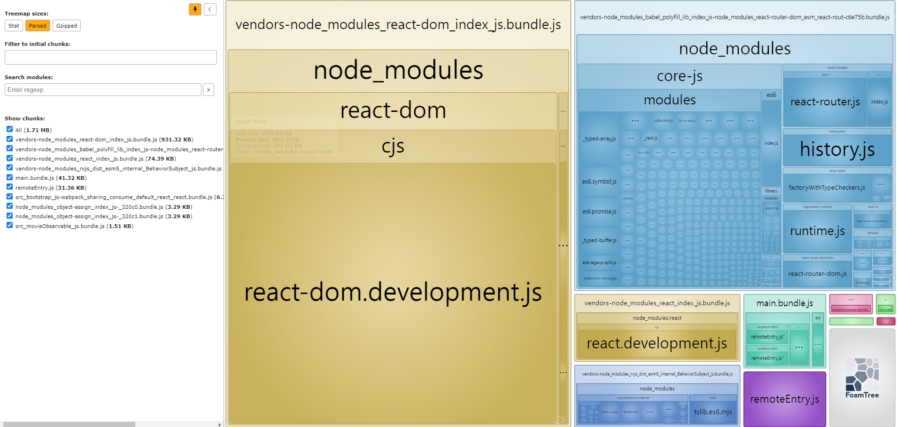

# Webpack 5 Ninja (2023) - Build Micro frontend and web apps

## 강의 링크

[링크](https://www.udemy.com/course/webpack-5-ninja-build-micro-frontend-and-web-apps)

## 배울 내용

- Understand and implement Webpack 5 basics
- Learn basics of Micro Frontends
- Build and package Web and Nodejs Application
- Learn about optimizing builds using techniques like Tree shaking , multiple bundles , caching and more
- Full guide using a sample project

## 수강 후기

- webpack의 Loader, Plugin에 대한 간단하게 이해를 할 수 있었다.
- Micro frontend에 대해 간단하게 이해를 할 수 있었다.

## 추가 테스트

`11.3 MF_Project_State_Management`의 결과물을 분석해보기.

## Next

- webpack으로 된 이 프로젝트를 vite로 바꿔보기.
